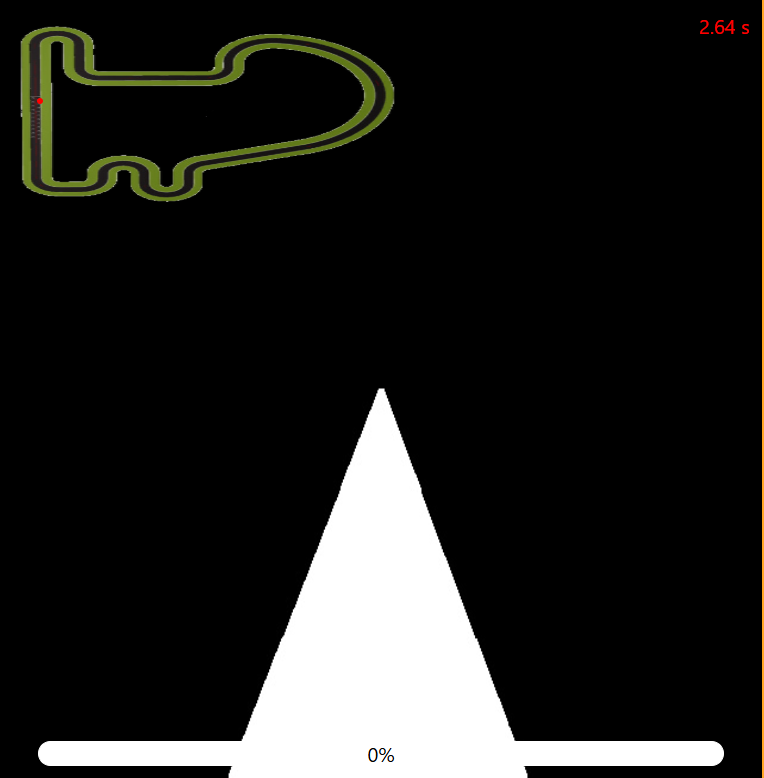
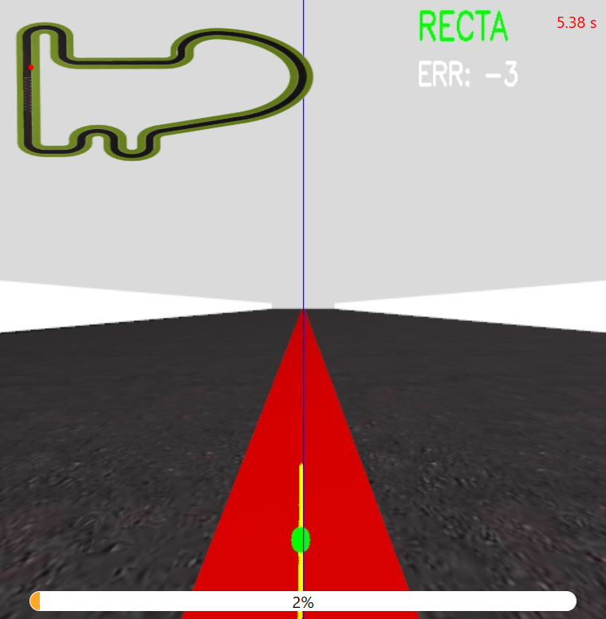
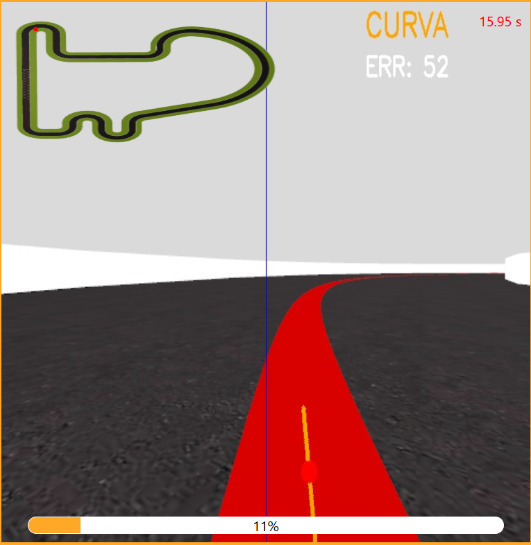

# Práctica 1: Visual Follow Line

**Autor:** Tarek Elshami Ahmed  
**Asignatura:** Visión Robótica — Máster Universitario en Visión Artificial

---

## Objetivo

El objetivo de esta práctica es programar un coche de Fórmula 1 equipado con una cámara frontal para que siga una línea roja en un circuito de carreras. Para ello hay que controlar dos variables: la velocidad lineal (V) y la velocidad angular (W), usando únicamente la información visual de la cámara.

---

## 1. Detección de la línea roja

Lo primero fue conseguir detectar la línea roja de forma robusta. La imagen que llega de la cámara está en RGB, pero trabajar directamente con ese espacio de color tiene un problema: el rojo puede verse muy diferente según la iluminación de la escena. Por eso convertí la imagen a **HSV**, un espacio donde el color está separado de la iluminación, lo que hace que el filtro funcione bien aunque cambien las condiciones de luz.

El rojo en HSV tiene además una particularidad: aparece en dos rangos del espectro, uno cerca del 0° y otro cerca del 180°. Por eso apliqué dos máscaras separadas y las combiné. El resultado, como se puede ver en la siguiente imagen, es una máscara binaria donde solo aparece la línea roja y el resto es negro.

---

## 2. Cálculo del centroide y el error

Con la máscara obtenida, el siguiente paso es saber dónde está la línea para calcular cuánto tiene que girar el coche. Para esto calculé el **centroide** de la línea, que es su posición horizontal media en el 25% inferior de la imagen, que es lo que tiene justo delante.

El **error** se calcula como la diferencia entre esa posición y el centro de la imagen. Si es 0, la línea está centrada y el coche va recto. Si es positivo, la línea está a la derecha y el coche debe girar a la derecha. Si es negativo, a la izquierda. Este error es lo que alimenta directamente al controlador para decidir el giro en cada fotograma.

Como se puede ver en las siguientes imágenes, los puntos pintados sobre la imagen muestran la posición de la línea en cada fila. En recta forman una columna casi vertical y en curva se inclinan siguiendo la trayectoria:

---

## 3. Detección de curva o recta

Para poder ir más rápido en rectas y frenar en curvas, necesitaba saber en qué situación estaba el coche en cada momento. Esto resultó ser el problema más difícil de resolver, y probé varias estrategias antes de dar con una que funcionara bien.

### Estrategia 1: Comparar dos franjas de la imagen

La primera idea fue calcular dos centroides a distintas alturas: uno en la parte baja, que representa dónde está el coche ahora mismo, y otro más arriba, que representa lo que viene por delante. Si diferían mucho horizontalmente, significaba que la línea se estaba curvando.

El problema fue que en curvas abiertas, donde la curvatura es suave, la línea en ambas franjas era prácticamente recta y la diferencia entre los dos centroides era mínima. El sistema no era capaz de distinguir esas curvas de una recta, lo que hacía que el coche las tomara demasiado rápido.

### Estrategia 2: Pendiente de la línea

La segunda idea fue calcular la pendiente de los puntos del centroide por filas. En recta, los puntos forman una línea casi vertical y la pendiente es cercana a 0. En curva, los puntos se inclinan y la pendiente aumenta.

El problema aquí fue que no encontré un umbral que separara los dos estados de forma fiable. En una curva abierta la pendiente oscilaba continuamente entre valores de recta y curva en el mismo tramo, lo que provocaba que el coche cambiara de comportamiento constantemente en esas zonas.

### Estrategia final: Umbral sobre el error

Después de descartar las dos anteriores, la solución que funcionó fue la más directa: usar el propio error de posición como indicador. Si el error es pequeño, el coche está centrado y va recto. Si supera un umbral, se está desviando y hay una curva. Es simple, pero resultó ser la más robusta de las tres porque no depende de cálculos geométricos que se ven afectados por la perspectiva o la forma de la curva.

---

## 4. Controlador PD

Una vez tengo el error, lo uso para calcular cuánto tiene que girar el coche. Para esto implementé un **controlador PD**, que tiene dos componentes.

El **término proporcional** corrige el giro en función de lo desviado que está el coche: si está muy desviado, gira mucho; si está poco desviado, gira poco. El problema de usar solo este término es que tiende a oscilar, corrige de más, se pasa al otro lado, vuelve a corregir, y así continuamente.

El **término derivativo** soluciona esto. No mira cuánto error hay ahora, sino cómo está cambiando. Si el error ya está disminuyendo porque la corrección está funcionando, el derivativo reduce el giro para no pasarse. Si el error está creciendo rápido, lo aumenta para reaccionar antes. En la práctica esto suaviza el movimiento y elimina las oscilaciones.

Usé dos configuraciones distintas de estas constantes: una más suave para las rectas y otra con más amortiguación para las curvas, donde las correcciones tienden a ser más bruscas.

---

## 5. Velocidad adaptativa

Con el controlador funcionando, el siguiente paso fue aumentar la velocidad. Mantenerla constante era demasiado conservador en rectas e innecesariamente rápido en algunas curvas.

La solución fue hacer que la velocidad dependiera del error: cuanto más desviado está el coche, más frena. Así acelera solo cuando está bien centrado sobre la línea y reduce la velocidad automáticamente al entrar en una curva. Además, como ya sé si estoy en curva o recta, uso una velocidad máxima distinta para cada caso, lo que permite ir bastante rápido en las rectas sin comprometer la estabilidad en las curvas.

---

## 6. Recuperación si pierde la línea

Uno de los aspectos que más trabajo dio fue conseguir que el coche se recuperara correctamente cuando pierde la línea.

El problema principal era que si el coche avanzaba sin ver la línea, acababa chocando contra la pared y quedándose bloqueado. Por eso la solución fue que el coche solo avance cuando ve el rojo, nunca a ciegas.

Para decidir hacia dónde girar, divido la imagen en mitad izquierda y mitad derecha y cuento los píxeles rojos en cada lado:

- Si hay rojo en algún lado, el coche gira hacia él y avanza despacio para acercarse a la línea.
- Si no ve rojo en ningún lado, se queda parado y gira sobre sí mismo usando la última dirección conocida hasta encontrarla.

Para probar que esto funcionaba correctamente, aumenté mucho la velocidad para forzar que el coche se saliera frecuentemente de la línea. Como se puede ver en el vídeo, el coche es capaz de completar una vuelta entera aunque se salga varias veces.

▶️ [Ver vídeo de recuperación](https://youtu.be/1EHNEQxepfM)

---

## 7. Resultados

Probé el sistema en tres circuitos distintos. Los vídeos muestran al final el tiempo de simulación y el RTF, que indica a qué velocidad está corriendo el simulador respecto al tiempo real. Con un RTF de 0.5, el simulador va a la mitad de velocidad, por lo que el tiempo real es aproximadamente la mitad del tiempo de simulación.

### Simple Circuit

Vuelta completa sin salirse. El tiempo de simulación fue de 1 minuto 51 segundos con un RTF de aproximadamente 0.5, lo que equivale a unos **55 segundos en tiempo real**.

▶️ [Ver vídeo](https://youtu.be/_DhA1SxZpdE)

### Montreal

Circuito mucho más largo. Grabé 8 minutos de simulación completando un 35% del circuito sin incidencias. No grabé la vuelta entera porque a ese RTF habría supuesto más de media hora de grabación.

▶️ [Ver vídeo](https://youtu.be/_A8g3pZmAx4)

### Montmeló

Otro circuito de gran tamaño. Grabé 6 minutos completando un 50% del recorrido correctamente, por el mismo motivo que en Montreal.

▶️ [Ver vídeo](https://youtu.be/40Qjk7qOpf0)
