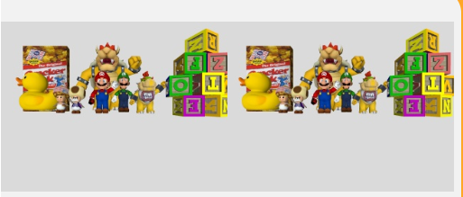
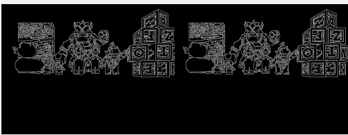
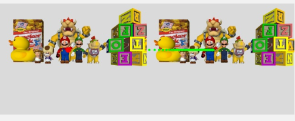
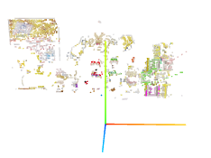

# Práctica: Reconstrucción 3D Estéreo

**Autor:** Tarek Elshami Ahmed  
**Asignatura:** Visión Robótica — Máster Universitario en Visión Artificial

---

## Objetivo

El objetivo de esta práctica es reconstruir la escena 3D que observa un robot Kobuki a partir de las imágenes de sus dos cámaras (izquierda y derecha). La idea es encontrar puntos comunes entre ambas imágenes y, sabiendo la posición de cada cámara, calcular dónde está ese punto en el espacio 3D.

---

## 1. Detección de píxeles de interés

Para decidir qué píxeles reconstruir, usé los **bordes** de la imagen como puntos de interés. Los bordes son zonas con cambios bruscos de intensidad, lo que hace que su vecindario sea característico y más fácil de localizar en la otra imagen. Para detectarlos usé el detector **Canny** de OpenCV.

Probé distintos umbrales. Con valores bajos se detectaban demasiados bordes y el proceso de emparejamiento se ralentizaba mucho sin ganar calidad. Con valores altos se perdían detalles de los objetos más pequeños. Los valores `(30, 100)` dieron un buen equilibrio entre densidad de puntos y tiempo de cómputo. Como se puede ver en la siguiente imagen, cada píxel blanco es un punto de interés que intentaremos emparejar.



*Imágenes originales de las cámaras izquierda y derecha.*



*Bordes detectados con Canny (30, 100).*

También probé a aplicar un filtrado bilateral antes de Canny para suavizar el ruido, pero en las pruebas no mejoraba los resultados y añadía tiempo de cómputo, así que lo descarté.

---

## 2. Emparejamiento por línea epipolar

Con los bordes detectados, el siguiente paso es encontrar, para cada píxel de interés de la imagen izquierda, su correspondiente en la imagen derecha. Buscarlo en toda la imagen sería extremadamente lento y daría muchos falsos positivos. Para reducir el espacio de búsqueda se usa la **línea epipolar**: la línea sobre la imagen derecha donde obligatoriamente tiene que estar el punto correspondiente.

La línea epipolar se obtiene proyectando el rayo 3D que pasa por el píxel de la imagen izquierda sobre la imagen derecha. En la práctica, muestreo puntos a lo largo de ese rayo y proyecto cada uno sobre la imagen derecha. Los puntos proyectados trazan la línea epipolar.

> **Nota:** este cálculo usa la geometría real de las cámaras en cada momento. No asume que están alineadas ni que la epipolar es horizontal, por lo que el emparejamiento funciona independientemente de la posición relativa de las cámaras.

La calibración de las cámaras no es perfecta, así que el punto correspondiente puede no estar exactamente sobre la línea epipolar calculada. Por eso busco en una **franja de ±2 píxeles** alrededor de la línea, y además solo comparo con píxeles que también son bordes en la imagen derecha.

Para decidir cuál de los candidatos es el correcto, extraigo un **patch de 11×11 píxeles** centrado en el punto de la imagen izquierda y lo comparo con el patch de cada candidato usando **SSD (Sum of Squared Differences)**: la suma de las diferencias al cuadrado entre los dos patches, píxel a píxel. El candidato con menor SSD es el más parecido.

Si el mejor match tiene un SSD superior a un umbral, lo descarto como falso positivo. Para ajustar ese umbral, fui probando distintos valores y observando visualmente los matches resultantes: con valores muy bajos se perdían demasiados puntos válidos, y con valores muy altos entraban matches claramente incorrectos. El valor **15000** fue el que mejor equilibrio daba entre cantidad y calidad de matches. Como se puede ver en la imagen y en el vídeo, las correspondencias encontradas son coherentes con la escena.



*Correspondencias encontradas entre ambas imágenes.*

▶️ [Ver vídeo de matches](https://youtu.be/t37acJVpJrs)

---

## 3. Triangulación

Una vez que tengo un par de píxeles emparejados, puedo calcular su posición 3D. Cada píxel define un rayo que sale desde su cámara hacia la escena. Si el emparejamiento es correcto, los dos rayos deberían cruzarse en el punto real del objeto.

En la práctica, por errores de calibración, los dos rayos no se cruzan exactamente. Lo que hago es calcular los **dos puntos más cercanos** entre ambas rectas y tomar su **punto medio** como la posición 3D estimada.

Si los rayos pasan muy lejos uno del otro, el emparejamiento probablemente fue incorrecto. Por eso implementé un umbral de distancia: si los dos puntos más cercanos de los rayos están demasiado separados, descarto ese punto.

Para calibrar este umbral, ejecuté una versión que imprimía las estadísticas de distancia entre rayos para todos los puntos:

```
Puntos triangulados: 3432
Distancia rayos min: 0.0000, max: 2.9152, media: 0.0008
```

La media era 0.0008, lo que indica que la gran mayoría de emparejamientos son buenos y los rayos prácticamente se cruzan. Los outliers llegaban hasta 2.9, que son claramente malos emparejamientos. Fijé el umbral en **0.1**: suficientemente permisivo para no perder puntos válidos, pero filtra los errores evidentes.

---

## 4. Resultado

Como se puede ver en la siguiente imagen y en el vídeo, la reconstrucción final muestra las figuras de la escena con sus colores originales. Cada punto se pinta con el color del píxel original de la imagen izquierda.



*Reconstrucción 3D final. Se distinguen las siluetas de los objetos con sus colores originales.*

▶️ [Ver vídeo de la reconstrucción 3D](https://youtu.be/aAzL0eivq4E)

---

## 5. Problemas encontrados

**La reconstrucción salía espejada.** Fue el problema que más tiempo llevó diagnosticar porque el código no daba ningún error, simplemente el resultado salía invertido. El motivo era que las coordenadas de la imagen no coinciden con el sistema de coordenadas que usan internamente las funciones de proyección y retroproyección de HAL. Hay que convertir entre ambos sistemas antes y después de cada operación. Sin esta conversión, los ejes se intercambian y toda la geometría queda reflejada.

**Serialización JSON con tipos numpy.** La función `showImageMatching` serializa internamente los valores a JSON, y los enteros de numpy (`numpy.int64`) no son serializables. La solución fue convertir todos los valores a `int()` nativo de Python antes de pasarlos a las funciones del GUI.
