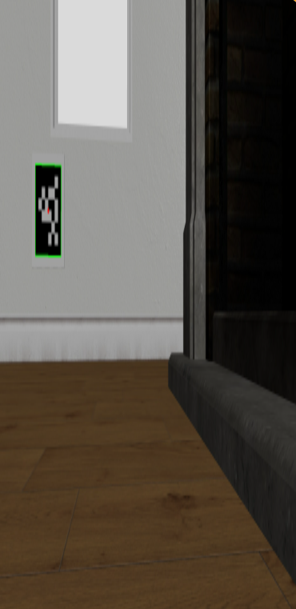
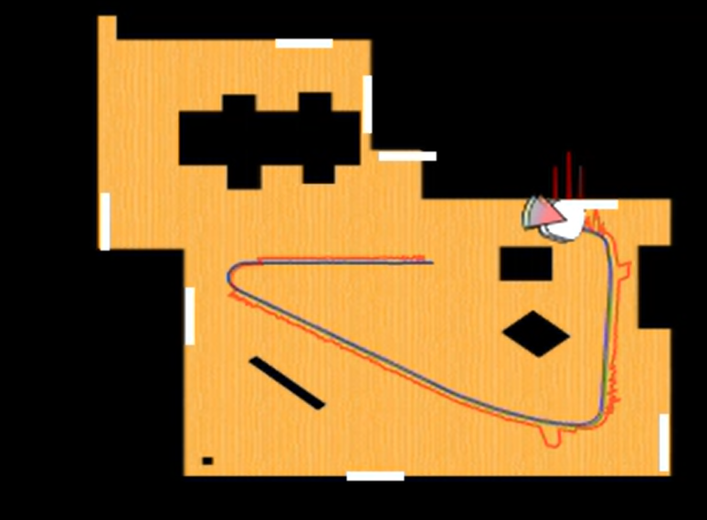

# Práctica 3: Localización Visual con Balizas

**Autor:** Tarek Elshami Ahmed  
**Asignatura:** Visión Robótica — Máster Universitario en Visión Artificial

---

## Objetivo

El objetivo de esta práctica es estimar la posición y orientación de un robot en un entorno 2D mediante balizas visuales. El robot dispone de una cámara con la que detecta AprilTags distribuidos por las paredes de la habitación, calcula su pose relativa respecto a cada marcador y la transforma al sistema de coordenadas global del mapa.

---

## 1. Detección de AprilTags

Cada AprilTags tag consiste en una cuadrícula binaria rodeada de un borde negro, donde el patrón interior codifica un identificador único. En esta práctica se usan como balizas visuales fijas distribuidas por las paredes del entorno simulado, con posiciones y orientaciones conocidas de antemano.

La detección se realiza sobre la imagen en escala de grises y devuelve, para cada tag encontrado, su identificador y las coordenadas en píxeles de sus cuatro esquinas, que son la entrada del siguiente paso.

---

## 2. Estimación de pose con solvePnP

Con las esquinas del tag en píxeles y sus coordenadas reales en metros, que se conocen de antemano porque todos los tags tienen el mismo tamaño físico, se aplica el algoritmo PnP (Perspective-n-Point) de OpenCV. La idea es calcular desde qué posición y orientación está viendo la cámara esos puntos. Se usa una variante diseñada específicamente para marcadores cuadrados planos, y el resultado es la pose del tag respecto a la cámara.

---

## 3. Transformación al sistema global

Conocer la posición del tag respecto a la cámara no es suficiente: se necesita la pose del robot en el sistema de coordenadas del mundo. Para ello se encadenan varias transformaciones: la posición del tag respecto a la cámara que devuelve solvePnP, la pose conocida de cada baliza en el mapa obtenida del fichero de configuración, y el offset entre la cámara y el centro del robot.

---

## 4. Fusión con odometría

Cuando el robot no detecta ninguna baliza, se usa la odometría para propagar la última pose conocida: se acumulan los incrementos de posición y orientación reportados por la odometría desde la última vez que se vio un tag.

---

## 5. Selección de la baliza más cercana

Cuando el robot ve simultáneamente varios tags, se selecciona el que ocupa mayor área en píxeles, asumiendo que un área mayor implica mayor proximidad. Una alternativa más directa habría sido usar la distancia real en metros que se puede extraer de la propia estimación de pose. Sin embargo, el criterio de área funciona bien en la práctica dado que todos los tags tienen el mismo tamaño físico, y tiene la ventaja de no requerir ejecutar solvePnP sobre todos los tags antes de elegir el mejor.

La razón para priorizar el más cercano es que PnP es más preciso cuanto mayor es la proyección del marcador en imagen: con más píxeles disponibles, el refinamiento de esquinas es más exacto y la estimación de pose más estable.

---

## 6. Movimiento

Para explorar el entorno se implementó una estrategia reactiva con tres estados: avanzar en línea recta cuando se detecta una baliza, girar sobre sí mismo buscando balizas cuando no se detecta ninguna, y esquivar obstáculos cuando el láser frontal detecta algo a menos de 0.5 metros, girando hacia el lado con más espacio libre según los sectores laterales del láser. El objetivo era mantener el robot en movimiento continuo para cubrir el entorno y poder evaluar la localización en distintas posiciones.

---

## 7. Resultados

La estimación sigue con precisión la trayectoria real cuando el robot observa balizas cercanas. A medida que el tag se aleja, PnP devuelve estimaciones menos estables resultando en saltos en la estimación

▶️ [Ver vídeo del sistema funcionando](https://youtu.be/thmY2oiHAZ4)
