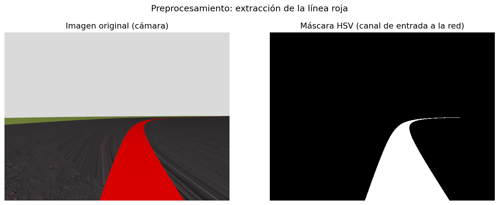
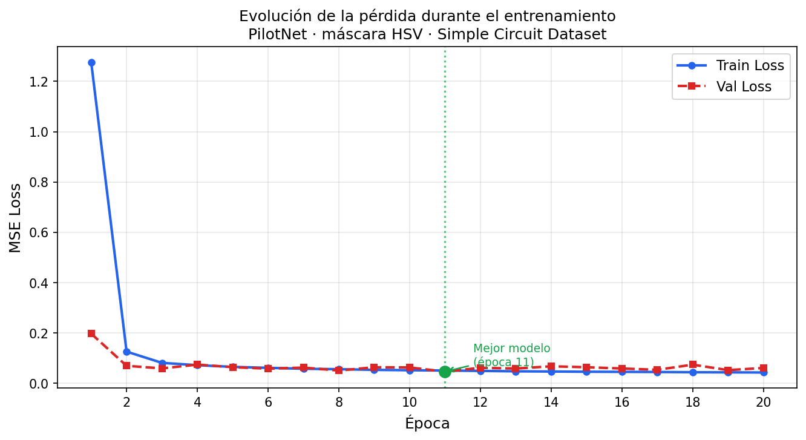

# Práctica 4: End-to-End Visual Control

**Autor:** Tarek Elshami Ahmed  
**Asignatura:** Visión Robótica — Máster Universitario en Visión Artificial

---

## Objetivo

El objetivo de esta práctica es entrenar una red neuronal que tome como entrada la imagen de la cámara del coche y prediga directamente las velocidades lineal (V) y angular (W) para completar un circuito. A diferencia de la práctica 1, donde programé explícitamente la lógica de control, aquí la red aprende ese comportamiento a partir de datos etiquetados.

---

## 1. Preprocesamiento: de RGB a máscara HSV

En el primer intento, entrené la red utilizando las imágenes RGB directamente. Sin embargo, el modelo presentaba un comportamiento inestable: aunque lograba completar algunas vueltas, en otras ejecuciones fallaba de manera aleatoria en curvas que antes había superado. El problema principal es que la señal RGB introduce un alto nivel de ruido visual. Al procesar elementos irrelevantes como texturas del asfalto o el cielo, la red genera predicciones inconsistentes, lo que impide que el pilotaje sea robusto.

La solución fue la misma que en la práctica 1: **convertir la imagen a HSV y extraer solo la máscara de la línea roja**. Así la red solo ve lo que importa: dónde está la línea. El canal de entrada pasa de 3 (RGB) a 1 (máscara binaria), lo que además reduce el tamaño del modelo y acelera el entrenamiento.

El procesamiento es idéntico al de P1: dos rangos en el espectro HSV para cubrir ambos extremos del rojo, combinados con OR. El resultado es una imagen en blanco y negro donde solo aparece la línea.

---

## 2. Arquitectura: PilotNet

Como arquitectura usé **PilotNet**, el modelo que NVIDIA publicó para conducción autónoma end-to-end. Consiste en una serie de capas convolucionales que extraen características de la imagen seguidas de capas completamente conectadas que mapean esas características a las dos salidas: velocidad lineal y angular.Es una arquitectura probada para este tipo de tareas y recomendada en el propio enunciado de la práctica. La entrada es la máscara HSV con sus etiquetas de velocidad lineal y angular asociadas. La salida son dos valores (v, w) que se pasan directamente a los actuadores del coche.

---

## 3. Entrenamiento

Entrené el modelo con el **Simple Circuit Dataset** de JdeRobot, dividido en 80% entrenamiento y 20% validación. El optimizador fue **Adam** con una tasa de aprendizaje de `1e-4`, la función de pérdida **MSE**, y entrené durante **20 épocas**.

La gráfica muestra una caída rápida en las primeras épocas y una convergencia estable a partir de la tercera. El modelo guardado corresponde a la época 11, donde la validación alcanzó su mínimo.

---

## 4. Inferencia en tiempo real

El modelo exportado en formato ONNX se carga en el entorno de Unibotics. En cada iteración se obtiene la imagen de la cámara, se genera la máscara HSV con el mismo preprocesamiento que se usó en entrenamiento, y se pasa por la red para obtener v y w.

---

## 5. Resultados

### Simple Circuit

Vuelta completa sin incidencias.

▶️ [Ver vídeo](https://youtu.be/T45jTb8w7Rs)

### Montreal

Circuito más largo. Grabé 10 minutos de simulación sin incidencias. No grabé la vuelta entera por el mismo motivo que en P1 a ese RTF la grabación completa llevaría demasiado tiempo.

▶️ [Ver vídeo](https://youtu.be/nPlporgFKQE)

### Montmeló

Otro circuito de gran tamaño. Grabé 12 minutos de simulación sin incidencias, sin grabar la vuelta entera por el mismo motivo que en Montreal.

▶️ [Ver vídeo](https://youtu.be/Iz8UMJ5-7lE)
